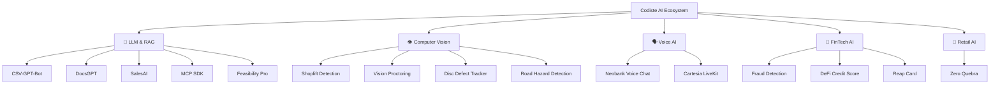

<!-- ═══════════════════════════════════════════════════════════════════════════
     CODISTE — AI-First Technology Company | GitHub Organization Profile
     ═══════════════════════════════════════════════════════════════════════════ -->

<div align="center">


</div>

<div align="center">


<br/><br/>

[](https://git.io/typing-svg)

<br/>

<a href="https://www.codiste.com"></a>
&nbsp;
<a href="https://www.linkedin.com/company/codiste"></a>
&nbsp;
<a href="https://twitter.com/codiste_"></a>
&nbsp;
<a href="mailto:info@codiste.com"></a>

<br/><br/>


&nbsp;&nbsp;

&nbsp;&nbsp;


</div>

<br/>

---

<div align="center">

## `> whoami`

</div>

<table align="center">
<tr>
<td width="60%">

**Codiste** is a premier **AI development company** founded in 2019, headquartered in the **USA** with engineering in **Ahmedabad, India**.

We specialize in building **intelligent systems** — from computer vision pipelines and voice AI agents to RAG-powered knowledge engines and real-time ML fraud detection.

Our open-source work showcases production-grade AI solutions deployed across **FinTech, Retail, Manufacturing, and Enterprise** domains.

</td>
<td width="40%" align="center">

```text
🧠 AI/ML Engineering
👁️ Computer Vision
🗣️ Voice AI & Real-time
📄 LLM & RAG Systems
🏦 FinTech AI
🏭 Industrial AI
```

</td>
</tr>
</table>

---

<div align="center">

## ⚡ Tech Stack

<br/>

### 🧠 AI / ML / LLM


### 🗣️ Voice & Real-time AI


### 🖥️ Full Stack & Infrastructure


</div>

---

<div align="center">

## 🚀 Open Source Projects

<br/>


</div>

<br/>

---

### 🧠 LLM, RAG & Conversational AI

<table>
<tr>
<td width="50%">

#### 📊 [CSV-GPT-Bot](https://github.com/CodisteEmeringTech/CSV-GPT-Bot)
> Upload CSV/Excel files and query them in natural language. Generates 15+ chart types including 3D, heatmaps, and violin plots.

`FastAPI` `Flutter` `OpenAI` `Python`

</td>
<td width="50%">

#### 📄 [DocsGPT](https://github.com/CodisteEmeringTech/DocsGPT)
> Document-based AI Q&A — upload any document and interact with its content using natural language queries.

`Python` `LangChain` `OpenAI` `RAG`

</td>
</tr>
<tr>
<td width="50%">

#### 💼 [SalesAI](https://github.com/CodisteEmeringTech/SalesAI)
> Extract insights from meeting recordings — auto-summarization, customer analysis, budget extraction, and a chatbot for querying meeting content.

`FastAPI` `Flutter` `AssemblyAI` `ChromaDB` `OpenAI`

</td>
<td width="50%">

#### 🔌 [Router MCP Connect SDK](https://github.com/CodisteEmeringTech/router-mcp-connect-sdk)
> SDK for embedding Model Context Protocol (MCP) provider connections into any web app. Part of the RouteMCP ecosystem.

`TypeScript` `React` `MCP` `npm Package`

</td>
</tr>
<tr>
<td width="50%">

#### 📋 [Feasibility Pro](https://github.com/CodisteEmeringTech/feasibility-pro)
> AI-powered project feasibility assessment platform with intelligent analysis and recommendations.

`React` `TypeScript` `Vite` `Tailwind CSS` `shadcn/ui`

</td>
<td width="50%">

</td>
</tr>
</table>

---

### 👁️ Computer Vision & Detection

<table>
<tr>
<td width="50%">

#### 🛍️ [Shoplift Detection](https://github.com/CodisteEmeringTech/Shoplift_Detection)
> Real-time shoplifting detection using video analysis. Supports uploaded video and live streams with bounding boxes and confidence scores.

`Flask` `Streamlit` `MobileNetV3` `YOLO` `GRU-RNN`

</td>
<td width="50%">

#### 👁️ [Vision Proctoring](https://github.com/CodisteEmeringTech/VisionProctoring)
> AI-powered remote interview monitoring — detects multiple faces, eye movement anomalies, and head position changes.

`Python` `PyQt6` `OpenCV` `TensorFlow`

</td>
</tr>
<tr>
<td width="50%">

#### 🏭 [Disc Defect Tracker](https://github.com/CodisteEmeringTech/disc-defect-tracker)
> Real-time visual inspection for manufacturing. Zero-shot defect detection on conveyor-belt feeds — cracks, porosity, dents, scratches.

`FastAPI` `Next.js 14` `YOLO-World` `SSE` `ffmpeg`

</td>
<td width="50%">

#### 🚗 [Road Hazard Detection](https://github.com/CodisteEmeringTech/Road-hazard-detection)
> Computer vision system for detecting road hazards including potholes, debris, and dangerous conditions in real-time.

`Python` `Computer Vision` `Deep Learning`

</td>
</tr>
</table>

---

### 🗣️ Voice AI & Real-time Communication

<table>
<tr>
<td width="50%">

#### 🎙️ [Neobank Voice Chat](https://github.com/CodisteEmeringTech/neobank-voice-chat)
> Real-time voice AI agent for banking — natural conversations with connection status indicators and responsive interface.

`React` `TypeScript` `ElevenLabs` `Vite` `Tailwind CSS`

</td>
<td width="50%">

#### 🔊 [Cartesia LiveKit](https://github.com/CodisteEmeringTech/cartesia-livekit)
> Voice/Audio AI integration combining Cartesia's text-to-speech with LiveKit's real-time communication infrastructure.

`Cartesia AI` `LiveKit` `Real-time Audio` `TTS`

</td>
</tr>
</table>

---

### 🏦 FinTech & NeoBank AI

<table>
<tr>
<td width="33%">

#### 💳 [Neo Bank Reap Card](https://github.com/CodisteEmeringTech/neo-bank-reap-card)
> Neobank card management system with virtual/physical card issuance and rewards functionality.

`FinTech` `Card Management`

</td>
<td width="33%">

#### 📊 [DeFi Credit Score](https://github.com/CodisteEmeringTech/CodisteEmeringTech-neo-bank-defi-credit-score)
> DeFi-based credit scoring — computes creditworthiness from on-chain activity and decentralized finance data.

`DeFi` `Credit Scoring` `Blockchain`

</td>
<td width="33%">

#### 🛡️ [Fraud Detection](https://github.com/CodisteEmeringTech/neo-bank-fraud-detection)
> ML-powered real-time fraud detection for neobank transactions with anomaly detection and pattern recognition.

`ML` `Fraud Detection` `Real-time`

</td>
</tr>
</table>

---

### 🏪 Retail & Supply Chain AI

<table>
<tr>
<td>

#### 🥬 [Zero Quebra](https://github.com/CodisteEmeringTech/zero-quebra)
> AI-driven markdown/discount decision engine for perishable goods in retail. Multi-role auth, real-time WebSocket alerts, COO dashboard with KPIs (shrinkage reduction, savings), and i18n support.

`React 18` `TypeScript` `Node.js` `Express` `Prisma` `PostgreSQL` `WebSocket` `Zustand`

</td>
</tr>
</table>

---

<div align="center">

## 📈 GitHub Activity

<br/>


<br/><br/>


&nbsp;


</div>

---

<div align="center">

## 🏗️ Project Architecture Overview



</div>

---

<div align="center">

## 🤝 Let's Build Together

<br/>

Whether you need **AI-powered automation**, **real-time computer vision**, or **voice-enabled interfaces** — we've shipped it in production.

<br/>

[](https://www.codiste.com/contact)
&nbsp;
[](https://www.codiste.com/services)
&nbsp;
[](https://www.codiste.com/case-studies)

<br/><br/>

---

<sub>

**Open Source** is at the heart of what we do. Star a repo, open an issue, or submit a PR — we love contributions.

</sub>

<br/>


**© 2026 Codiste · info@codiste.com · [codiste.com](https://www.codiste.com)**

</div>
