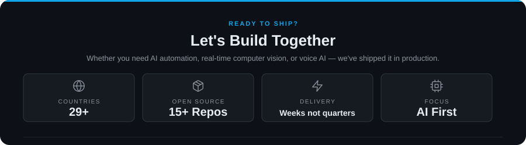

<!--
═══════════════════════════════════════════════════════════════
  CODISTE - AI-First Technology Company
═══════════════════════════════════════════════════════════════
-->

 

<table width="100%" cellspacing="0" cellpadding="14">
  <tr>
    <td align="center" valign="middle" width="25%"></td>
    <td align="center" valign="middle" width="25%"></td>
    <td align="center" valign="middle" width="25%"></td>
    <td align="center" valign="middle" width="25%"></td>
  </tr>
</table>

<table width="100%" cellspacing="0" cellpadding="16">
  <tr>
    <td align="center" width="20%">Founded <strong>2019</strong></td>
    <td align="center" width="20%">Serving <strong>29+ Countries</strong></td>
    <td align="center" width="20%">Focus <strong>AI First</strong></td>
    <td align="center" width="20%">Open Source <strong>15+ Repos</strong></td>
    <td align="center" width="20%">Visitors </td>
  </tr>
</table>

---

## About Us

**Codiste** is the AI Agent Studio preferred by VCs. We ship computer vision, voice AI, RAG pipelines and real-time inference from idea to production in weeks, not quarters. Deployed across FinTech, Retail, Healthcare and Manufacturing in **29+ countries**.

> We don't build generic software. We craft systems that understand your industry and compound your edge over time.

---

## What We Build

| Capability | What We Ship |
|:---|:---|
| **AI / ML** | LLM pipelines · RAG systems · Computer Vision · Voice AI · Real-time Inference |
| **Full Stack** | React · Next.js · TypeScript · Node.js · Flutter |
| **Cloud** | AWS · GCP · Docker · PostgreSQL |
| **Domains** | FinTech · Retail · Manufacturing · Healthcare · Enterprise |

---

## Tech Stack

<table width="100%">
<tr>
<td width="150" valign="middle" align="center">

</td>
<td valign="middle">

</td>
</tr>
<tr><td colspan="2" height="6"></td></tr>
<tr>
<td width="150" valign="middle" align="center">

</td>
<td valign="middle">

</td>
</tr>
<tr><td colspan="2" height="6"></td></tr>
<tr>
<td width="150" valign="middle" align="center">

</td>
<td valign="middle">

</td>
</tr>
<tr><td colspan="2" height="6"></td></tr>
<tr>
<td width="150" valign="middle" align="center">

</td>
<td valign="middle">

</td>
</tr>
</table>

---

## Open Source Projects

Production-grade AI solutions built, tested, and deployed in real-world environments across 29+ countries.

 

### LLM, RAG & Conversational AI

<table width="100%">
<tr>
<td width="33%" valign="top">
<strong><a href="https://github.com/CodisteEmeringTech/CSV-GPT-Bot">CSV-GPT-Bot</a></strong> 
Upload CSV/Excel files and query in natural language. Generates 15+ chart types including 3D, heatmaps & violin plots.  
<code>FastAPI</code> <code>Flutter</code> <code>OpenAI</code>
</td>
<td width="33%" valign="top">
<strong><a href="https://github.com/CodisteEmeringTech/DocsGPT">DocsGPT</a></strong> 
Document-based AI Q&A engine using RAG — upload any document and interact with its content.  
<code>Python</code> <code>LangChain</code> <code>OpenAI</code>
</td>
<td width="33%" valign="top">
<strong><a href="https://github.com/CodisteEmeringTech/SalesAI">SalesAI</a></strong> 
Extract insights from meeting recordings — auto-summarization, customer analysis, ChromaDB vector search.  
<code>FastAPI</code> <code>Flutter</code> <code>AssemblyAI</code>
</td>
</tr>
<tr>
<td valign="bottom"></td>
<td valign="bottom"></td>
<td valign="bottom"></td>
</tr>
<tr>
<td width="33%" valign="top">
<strong><a href="https://github.com/CodisteEmeringTech/router-mcp-connect-sdk">Router MCP Connect SDK</a></strong> 
SDK for embedding MCP provider connections into any web app. Published as <code>@routemcp/connect-sdk</code> on npm.  
<code>TypeScript</code> <code>React</code>
</td>
<td width="33%" valign="top">
<strong><a href="https://github.com/CodisteEmeringTech/feasibility-pro">Feasibility Pro</a></strong> 
AI-powered project feasibility assessment with intelligent analysis and recommendations.  
<code>React</code> <code>TypeScript</code> <code>Tailwind</code>
</td>
</tr>
<tr>
<td valign="bottom"></td>
<td valign="bottom"></td>
</tr>
</table>

 

### Computer Vision & Detection

<table width="100%">
<tr>
<td width="33%" valign="top">
<strong><a href="https://github.com/CodisteEmeringTech/Shoplift_Detection">Shoplift Detection</a></strong> 
Real-time shoplifting detection with bounding boxes, confidence scores & clip extraction.  
<code>Flask</code> <code>Streamlit</code> <code>YOLO</code> <code>GRU-RNN</code>
</td>
<td width="33%" valign="top">
<strong><a href="https://github.com/CodisteEmeringTech/VisionProctoring">Vision Proctoring</a></strong> 
AI-powered remote interview monitoring — face detection, eye tracking, head position analysis.  
<code>Python</code> <code>PyQt6</code> <code>OpenCV</code> <code>TensorFlow</code>
</td>
<td width="33%" valign="top">
<strong><a href="https://github.com/CodisteEmeringTech/disc-defect-tracker">Disc Defect Tracker</a></strong> 
Zero-shot defect detection on conveyor feeds — cracks, porosity, dents & scratches.  
<code>FastAPI</code> <code>Next.js 14</code> <code>YOLO-World</code>
</td>
</tr>
<tr>
<td valign="bottom"></td>
<td valign="bottom"></td>
<td valign="bottom"></td>
</tr>
<tr>
<td width="33%" valign="top">
<strong><a href="https://github.com/CodisteEmeringTech/Road-hazard-detection">Road Hazard Detection</a></strong> 
Computer vision for detecting potholes, debris & road hazards in real-time.  
<code>Python</code> <code>OpenCV</code> <code>Deep Learning</code>
</td>
</tr>
<tr>
<td valign="bottom"></td>
</tr>
</table>

 

### Voice AI & Real-time Communication

<table width="100%">
<tr>
<td width="33%" valign="top">
<strong><a href="https://github.com/CodisteEmeringTech/neobank-voice-chat">Neobank Voice Chat</a></strong> 
Real-time voice AI agent for banking with natural voice conversations.  
<code>React</code> <code>TypeScript</code> <code>ElevenLabs</code>
</td>
<td width="33%" valign="top">
<strong><a href="https://github.com/CodisteEmeringTech/cartesia-livekit">Cartesia LiveKit</a></strong> 
Voice/Audio AI combining Cartesia TTS with LiveKit for low-latency conversations.  
<code>Cartesia</code> <code>LiveKit</code>
</td>
</tr>
<tr>
<td valign="bottom"></td>
<td valign="bottom"></td>
</tr>
</table>

 

### FinTech & NeoBank AI

<table width="100%">
<tr>
<td width="33%" valign="top">
<strong><a href="https://github.com/CodisteEmeringTech/neo-bank-fraud-detection">Neo Bank Fraud Detection</a></strong> 
ML-powered real-time fraud detection with anomaly detection & sub-100ms inference.  
<code>Python</code> <code>ML</code>
</td>
<td width="33%" valign="top">
<strong><a href="https://github.com/CodisteEmeringTech/CodisteEmeringTech-neo-bank-defi-credit-score">DeFi Credit Score</a></strong> 
AI-driven credit scoring from on-chain activity for decentralized banking.  
<code>Python</code> <code>Blockchain</code>
</td>
<td width="33%" valign="top">
<strong><a href="https://github.com/CodisteEmeringTech/neo-bank-reap-card">Neo Bank Reap Card</a></strong> 
Neobank card management with virtual/physical card issuance & rewards.  
<code>React</code> <code>Node.js</code>
</td>
</tr>
<tr>
<td valign="bottom"></td>
<td valign="bottom"></td>
<td valign="bottom"></td>
</tr>
</table>

 

### Retail & Supply Chain AI

<table width="100%">
<tr>
<td width="33%" valign="top">
<strong><a href="https://github.com/CodisteEmeringTech/zero-quebra">Zero Quebra</a></strong> 
AI-driven markdown/discount engine for perishable goods. Multi-role auth, WebSocket alerts, KPI dashboards & i18n.  
<code>React 18</code> <code>Node.js</code> <code>Prisma</code> <code>PostgreSQL</code>
</td>
</tr>
<tr>
<td valign="bottom"></td>
</tr>
</table>

---

<!--
## AI DLC System Architecture

> Our end-to-end AI development lifecycle — from data ingestion to production deployment.

<table width="100%">
<tr>
<td width="150" valign="middle"><b>01 · INGEST</b> <b>Data Ingest</b></td>
<td valign="middle">

</td>
</tr>
<tr><td colspan="2" height="6"></td></tr>
<tr>
<td width="150" valign="middle"><b>02 · PROCESS</b> <b>Processing</b></td>
<td valign="middle">

</td>
</tr>
<tr><td colspan="2" height="6"></td></tr>
<tr>
<td width="150" valign="middle"><b>03 · MODEL</b> <b>AI Model</b></td>
<td valign="middle">

</td>
</tr>
<tr><td colspan="2" height="6"></td></tr>
<tr>
<td width="150" valign="middle"><b>04 · DEPLOY</b> <b>Deployment</b></td>
<td valign="middle">

</td>
</tr>
<tr><td colspan="2" height="6"></td></tr>
<tr>
<td width="150" valign="middle"><b>05 · MONITOR</b> <b>Monitoring</b></td>
<td valign="middle">

</td>
</tr>
</table>

---
-->

 

&nbsp;&nbsp;
&nbsp;&nbsp;

  

© 2026 Codiste · Nishant@codiste.com · <a href="https://www.codiste.com">codiste.com</a> · Open source at heart — star a repo, open an issue, or submit a PR.

